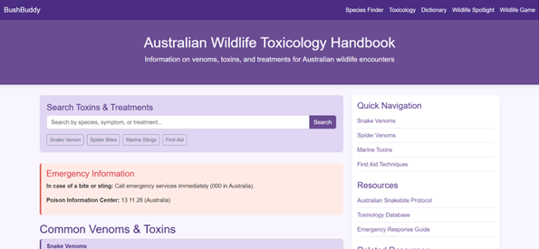

🦘 <b>BushBuddy - Australian Wildlife Safety</b>

  
  
<strong>A comprehensive native Australian wildlife guide that helps identify potentially dangerous species in your area, and provide essential information at your fingertips.</strong>

  

    
    
    
    
  

✨ <b>Features</b>
<table>
<tr>
<td width="50%">
🔍 <b>Species Finder:</b>
Identify wildlife in your area using geolocation technology. Get instant information about species near you. 
   
🧪 <b>Toxicology Handbook:</b>
Comprehensive database of venomous and dangerous Australian creatures with safety protocols. 
   
📚 <b>Scientific Dictionary:</b>
Learn about Australian wildlife terminology with detailed explanations and pronunciations. 
</td>
<td width="50%">
🦘 <b>Wildlife Spotlight</b>
Discover random Australian species with detailed profiles, habitats, and fascinating facts. 
   
🎮 <b>Wildlife Safety Game</b>
Interactive matching game that teaches essential safety tips in an engaging way. 
   
📱 <b>Mobile Responsive</b>
Optimized for use on any device, perfect for outdoor adventures. 
</td>
</tr>
</table>

📷 <b>Screenshots</b>

  <table>
    <tr>
      <td align="center">
        
         <strong>Main Page</strong>
      </td>
      <td align="center">
        
         <strong>Species Finder</strong>
      </td>
    </tr>
    <tr>
      <td align="center">
        
         <strong>Toxicology Handbook</strong>
      </td>
      <td align="center">
        
         <strong>Wildlife Spotlight</strong>
      </td>
    </tr>
  </table>

🚀 <b>Quick Start
Prerequisites</b>

Python 3.6 or higher
Git
OpenAI API key

Installation

Clone the repository
bashgit clone https://github.com/ytheycallmecooper/Cthomson-Majorwork.git
cd bushbuddy

Create and activate virtual environment
bash# Create virtual environment
python -m venv venv

# Activate virtual environment
# On Windows:
venv\Scripts\activate

# On macOS/Linux:
source venv/bin/activate

Install dependencies
bashpip install -r requirements.txt

Environment setup
bash# Create .env file
touch .env

# Add your OpenAI API key
echo "OPENAI_API_KEY=your_api_key_here" > .env

Run the application
bashpython main.py

Open your browser
Navigate to http://localhost:5000 to start using BushBuddy!

🛠️ <b>Tech Stack</b>

  <table>
    <tr>
      <td align="center" width="25%">
        
         <strong>Backend</strong>
      </td>
      <td align="center" width="25%">
        
         <strong>Web Framework</strong>
      </td>
      <td align="center" width="25%">
        
         <strong>Frontend</strong>
      </td>
      <td align="center" width="25%">
        
         <strong>AI Integration</strong>
      </td>
    </tr>
  </table>

<b>APIs & Services:</b>
 
<b>Atlas of Living Australia</b> - Comprehensive biodiversity data 
 
<b>iNaturalist</b> - Species identification and occurrence data 
 
<b>OpenAI</b> - AI-powered content generation and analysis and data support 
 
 
 

🤝 <b>Contributing</b>
We welcome contributions! Here's how you can help:
 
 

📄 <b>License</b>
This project is licensed under the MIT License - see the LICENSE file for details.
 
 

🙠<b>Acknowledgments</b> 
Atlas of Living Australia for providing comprehensive biodiversity data 
iNaturalist community for species identification resources 
OpenAI for AI capabilities 
Australian wildlife researchers and conservationists 
 
 

📞 <b>Support</b>
🐛 Found a bug? Open an issue
💡 Have a feature request? Start a discussion

  
<strong>Made with ❤️ for Australian wildlife safety</strong>

  

    <a href="#-bushbuddy---australian-wildlife-safety">Back to top ⬆️</a>
  

